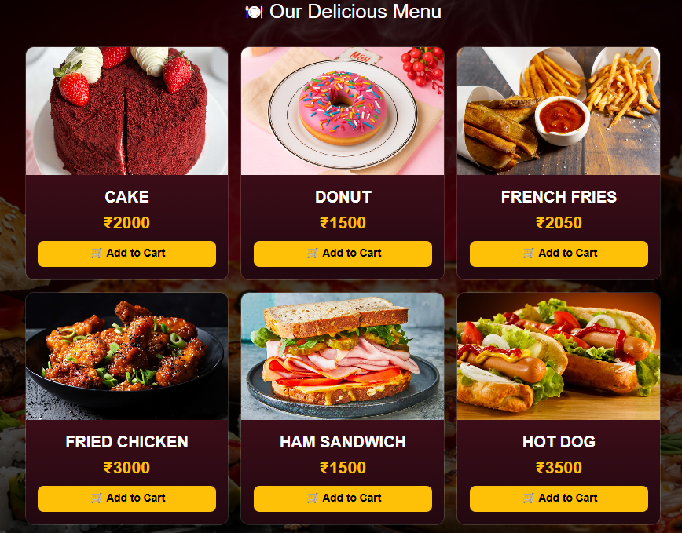
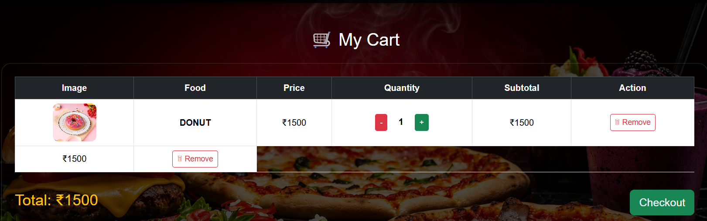
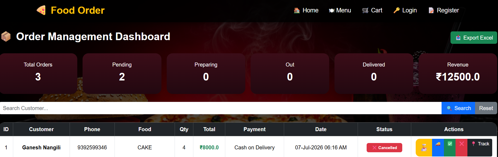
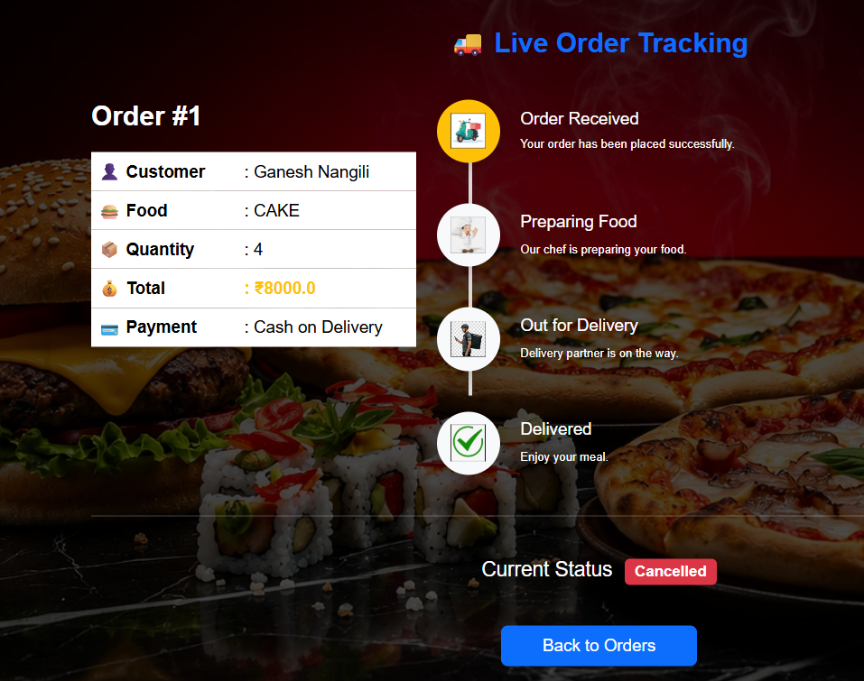
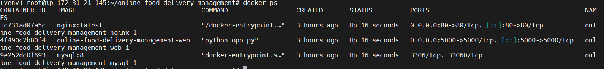

# 🍔 Online Food Delivery Management System | DevOps Project

## 📌 Project Overview

The **Online Food Delivery Management System** is a web application developed using **Python Flask** and **MySQL**. The project demonstrates modern DevOps practices including containerization, CI/CD automation, code quality analysis, and cloud deployment on AWS.

---

## 🚀 Tech Stack

### Application

* Python 3
* Flask
* HTML5
* CSS3
* Bootstrap
* JavaScript
* Jinja2

### Database

* MySQL 8

### DevOps

* Docker
* Docker Compose
* Jenkins
* SonarQube
* Git
* GitHub

### Cloud

* AWS EC2 (Ubuntu)

---

## 📂 Project Structure

```text
online-food-delivery-management/
│
├── app.py
├── requirements.txt
├── Dockerfile
├── docker-compose.yml
├── Jenkinsfile
├── static/
├── templates/
├── database/
└── README.md
```

---

## ✨ Features

* User Registration & Login
* Browse Food Menu
* Add to Cart
* Place Orders
* Order History
* Responsive User Interface
* MySQL Database Integration
* Dockerized Application
* Automated CI/CD Pipeline with Jenkins
* Code Quality Analysis with SonarQube

---

## 🐳 Docker

### Build Docker Image

```bash
docker build -t online-food-delivery-management-web .
```

### Run Using Docker Compose

```bash
docker compose up -d --build
```

### Stop Containers

```bash
docker compose down
```

### View Running Containers

```bash
docker ps
```

---

## ⚙️ Jenkins CI/CD Pipeline

Pipeline stages include:

1. Clone Repository
2. Install Dependencies
3. SonarQube Code Analysis
4. Build Docker Image
5. Deploy Application with Docker Compose

---

## 🔍 SonarQube

SonarQube is integrated into the Jenkins pipeline to perform static code analysis.

It checks for:

* Bugs
* Vulnerabilities
* Code Smells
* Security Hotspots
* Maintainability
* Reliability

---

## ☁️ AWS Deployment

The application is deployed on an AWS EC2 Ubuntu instance.

Deployment workflow:

* Launch EC2 Instance
* Install Docker & Docker Compose
* Configure Jenkins
* Clone the Repository
* Build and Run the Application
* Access the Application via the EC2 Public IP

---

## ▶️ Run Locally

Clone the repository:

```bash
git clone <https://github.com/ganesh939259-dotcom/online-food-delivery-management.git>
cd online-food-delivery-management
```

Create a virtual environment:

```bash
python3 -m venv venv
source venv/bin/activate
```

Install dependencies:

```bash
pip install -r requirements.txt
```

Run the application:

```bash
python app.py
```

Open in your browser:

```text
http://13.127.3.51:5000
```

---


# 📸 Screenshots

##  Home Page

.png>)

---
##  Register page
.png>)

---

##  Login Page
.png>)

---

##  Food Menu



---

## Card


---
## Checkout page


---
## Orders page


---
## Tracking page


---

## Docker containers


---


## 📈 Future Enhancements

* HTTPS with Nginx Reverse Proxy
* Monitoring with Prometheus
* Visualization with Grafana
* Automated Backups
* GitHub Actions CI/CD
* Multi-environment Deployment

---

## 👨‍💻 Author

**Ganesh Nangili**

GitHub:https://github.com/ganesh939259-dotcom/online-food-delivery-management.git<ganesh939259-dotcom>

---
## 👨‍💻 Connect with Me

- 💼 LinkedIn:https://www.linkedin.com/in/nangili-ganesh-8b1a02262/

## ⭐ If you found this project useful, please consider giving it a star on GitHub!
